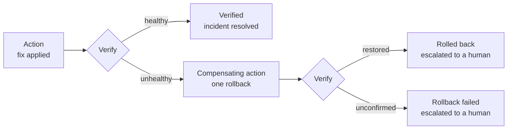

When an applied fix fails [verification](/autonomy/verification), ChangeGuard does not retry, tweak, or experiment. It performs exactly one **compensating action**: a rollback that restores the fields it changed to their pre-remediation values, runs through the same pipeline as any other remediation, is itself verified, and ends with the incident **escalated** to a human.

## Pre-state is captured before anything is written

Before the executor applies the **original** fix, it reads and records the current values of every field the patch will touch. This read-before-write capture is mandatory: if the executor cannot record pre-state (for example, the control plane is unreachable at that moment), it **refuses to execute the fix at all**. ChangeGuard never makes a change it does not know how to undo.

## Only what was touched is restored

The rollback is a minimal patch built from the captured pre-state - it restores _only the fields the original remediation changed_. Your own changes to other fields are untouched: if an engineer added an environment variable between the fix and the rollback, that variable survives.

## Drift means stop, not force

Before writing, the executor compares the live values of the touched fields against what the original remediation left behind. If they differ - a human or another system changed one of those fields since - the rollback **refuses** and terminates as `failed` with `human intervention required`. ChangeGuard will not overwrite a human's change to win an argument with the cluster; the incident is escalated with both states visible in the audit trail.

## Same-or-stronger authorization

A rollback never runs with less authority than the original fix had:

- **Human-approved original** → the rollback is created as `proposed` and waits for a human to approve it.
- **Policy-approved original (Auto)** → the rollback is auto-approved **only if the current [execution policy](/autonomy/execution-policy) still allows it**. If the policy has since been tightened, the rollback is created `proposed` with a `rollback_policy_denied` audit event and waits for a human.

## One attempt, ever

Each remediation can be rolled back at most once, enforced by an atomic one-shot claim that holds even across controller crashes and restarts. There is no rollback of a rollback and no retry loop: a rollback that fails its own verification is marked `failed` once and left for a human. See [Safety guarantees](/autonomy/safety-guarantees) for how these invariants were validated.

## The incident always ends with you

A rollback - even a perfectly verified one - restores your cluster but does not fix the underlying problem, and it means the automated fix for this incident already failed once. So every rollback terminal state moves the incident to **`escalated`**: it appears as such in the dashboard, carries the complete action history on its [activity timeline](/autonomy/audit-trail), and waits for a human decision. The loop never buries its own failures.