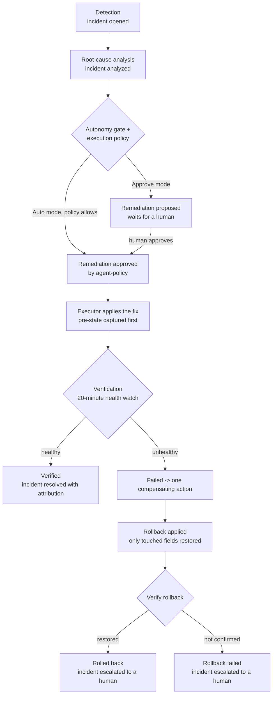

ChangeGuard AI can close the loop on a failure: detect a failing workload, diagnose the root cause, propose a concrete fix, execute that fix inside your cluster under an explicit policy, verify that the fix actually worked, and roll it back if it didn't. Every step is recorded, attributable, and visible in the dashboard.

**It does none of that by default.** ChangeGuard AI ships at autonomy level **Advise**, where it recommends and nothing executes.

This is a **closed-loop control system**, not an observability tool with a chatbot attached — but the loop is bounded by your policy, not by the system's own judgment. Nothing executes automatically until you set the [autonomy level](/autonomy/autonomy-model) to Auto **and** define a complete [execution policy](/autonomy/execution-policy). Below Auto, every action waits for a human to approve it.

## The loop

Two properties of this loop matter more than any individual feature:

1. **Every arrow is auditable.** Each transition appends an event to an append-only [audit trail](/autonomy/audit-trail), and the full lifecycle renders as an activity timeline on every incident in the dashboard.
2. **Failure escalates, it never loops.** A failed verification triggers exactly one compensating action, and a rollback - whether it succeeds or fails - always leaves the incident **escalated** for a human. The system never retries indefinitely, never rolls back a rollback, and never silently resolves an incident it couldn't fix.

## Lifecycle states

Remediations and incidents move through first-class states - not free-form strings - so you can filter, alert, and reason about them precisely.

| Remediation state | Meaning |
| --- | --- |
| `proposed` | A fix exists and is waiting for approval |
| `approved` | Approved by a human, or by `agent-policy` under Auto mode |
| `applying` | Claimed by the in-cluster executor |
| `applied` | The fix was applied; verification window open |
| `verified` | The workload recovered - verification confirmed the fix |
| `rolled_back` | The fix failed verification and its rollback was verified |
| `failed` | Terminal failure (apply failed, verification failed, or drift blocked a rollback) |
| `rejected` | A human declined the proposed fix |

| Incident state | Meaning |
| --- | --- |
| `open` | Detected, not yet diagnosed |
| `analyzed` | Root cause and recommended fix attached |
| `escalated` | The system verified a failure and needs human intervention |
| `resolved` | Closed - by a verified fix (with attribution) or by a human |

## Where to go next

<CardGroup cols={2}>
  <Card title="Autonomy model" icon="sliders" href="/autonomy/autonomy-model">
    The four-level dial that decides what ChangeGuard AI may do on its own
  </Card>

  <Card title="Execution policy" icon="shield-check" href="/autonomy/execution-policy">
    The allowlist contract that bounds Auto mode - editable from the dashboard
  </Card>

  <Card title="Verification" icon="clipboard-check" href="/autonomy/verification">
    How ChangeGuard AI proves a fix worked before claiming success
  </Card>

  <Card title="Compensating actions" icon="rotate-left" href="/autonomy/compensating-actions">
    Automatic rollback: pre-state capture, drift refusal, single attempt, escalation
  </Card>

  <Card title="Safety guarantees" icon="lock" href="/autonomy/safety-guarantees">
    The invariants that hold even when things crash mid-flight
  </Card>

  <Card title="RBAC boundaries" icon="key" href="/autonomy/rbac-boundaries">
    Why the control plane physically cannot exceed what you granted
  </Card>

  <Card title="Audit trail" icon="list-timeline" href="/autonomy/audit-trail">
    The append-only record and the incident activity timeline
  </Card>
</CardGroup>