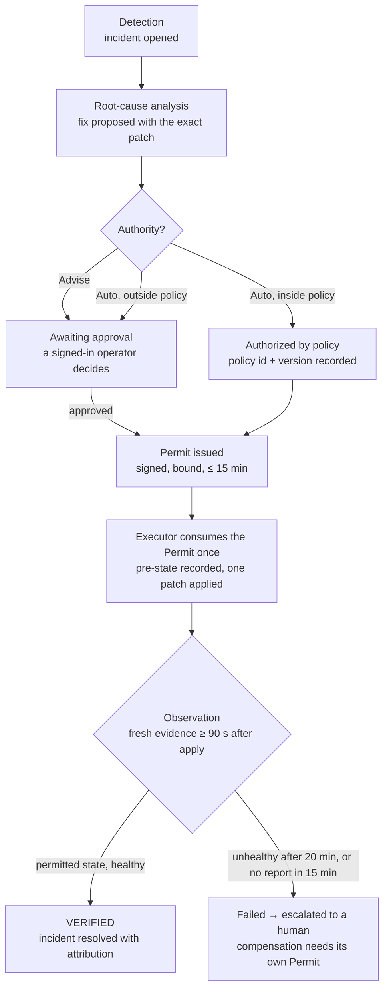

ChangeGuard can close the loop on a failure: detect a failing workload, diagnose the root cause, propose a concrete fix, obtain authority for exactly that fix, execute it through a verified Executor under a single-use [Permit](/govern/permit), verify that it actually worked against fresh evidence, and hand it to a human if it didn't. Every step is recorded against the change, attributable and visible in the product.

**It does none of that on its own by default.** Every environment starts in **Advise**: ChangeGuard proposes and waits for a person. Even in **Auto** it acts only inside an explicit policy, and outside that policy it falls back to Advise. See [Advise and Auto](/autonomy/autonomy-model).

## The loop

```mermaid
flowchart TD
    A[Detection<br/>incident opened] --> B[Root-cause analysis<br/>fix proposed with the exact patch]
    B --> C{Authority?}
    C -->|Advise| D[Awaiting approval<br/>a signed-in operator decides]
    C -->|Auto, inside policy| E[Authorized by policy<br/>policy id + version recorded]
    C -->|Auto, outside policy| D
    D -->|approved| F[Permit issued<br/>signed, bound, ≤ 15 min]
    E --> F
    F --> G[Executor consumes the Permit once<br/>pre-state recorded, one patch applied]
    G --> H{Observation<br/>fresh evidence ≥ 90 s after apply}
    H -->|permitted state, healthy| I[VERIFIED<br/>incident resolved with attribution]
    H -->|unhealthy after 20 min, or no report in 15 min| J[Failed → escalated to a human<br/>compensation needs its own Permit]
```

Three properties of this loop matter more than any individual feature:

1. **Nothing executes without a consumed Permit.** Judgment proposes; a human or a policy authorizes; the Permit carries that authority to the Executor for one action, once, for minutes. A revoked, expired, replayed or re-proposed change is refused before anything touches the cluster.
2. **Every arrow is auditable.** Each transition appends an event to an append-only [audit trail](/autonomy/audit-trail) — the approver or policy version, the Permit, the attempt, the pre-state, the result, the observation.
3. **Failure escalates, it never loops.** A failed verification or a silent attempt ends with a human in the loop. The system never retries indefinitely, never rolls back a rollback, and never resolves an incident it did not observe recovering.

## Lifecycle states

Remediations and incidents move through first-class states, so you can filter, alert and reason about them precisely.

| Remediation state | Meaning |
| --- | --- |
| `proposed` | A fix exists and is **awaiting approval** (Advise, or Auto outside the policy) |
| `approved` | Authorized by a named operator, or by `agent-policy` under Auto; a Permit is issued for it |
| `applying` | The Executor consumed the Permit — set by the consume, never by the Executor's say-so |
| `applied` | The patch was applied; the verification window is open |
| `verified` | A fresh observation showed the permitted state, healthy |
| `rolled_back` | The fix failed verification and its compensating action was verified |
| `failed` | Terminal failure: apply failed, verification failed, the attempt went unreported, or drift blocked a rollback |
| `rejected` | A human declined the proposed fix |

The product also shows the execution ladder on every record — **Permit issued → Execution started → Action applied → Verifying → Verified** (or Failed, Rolled back) — and the Permit's own state: Not issued, Authorized · expires in …, Consumed, Expired, or Revoked · reason.

| Incident state | Meaning |
| --- | --- |
| `open` | Detected, not yet diagnosed |
| `analyzed` | Root cause and recommended fix attached |
| `escalated` | The system verified a failure and needs human intervention |
| `resolved` | Closed — by a verified fix (with attribution) or by a human |

## Where to go next

<CardGroup cols={2}>
  <Card title="Advise and Auto" icon="sliders" href="/autonomy/autonomy-model">
    The two modes, per environment, and what each may do.
  </Card>

  <Card title="Execution policy" icon="shield-check" href="/autonomy/execution-policy">
    The allowlist contract that bounds Auto — and what a policy edit does to live Permits.
  </Card>

  <Card title="ChangeGuard Permit" icon="ticket" href="/govern/permit">
    What is bound, how it is consumed, how it expires and is revoked.
  </Card>

  <Card title="Cloud Executor" icon="cloud" href="/execute/cloud-executor">
    The preferred Executor: nothing to install.
  </Card>

  <Card title="Verification" icon="clipboard-check" href="/autonomy/verification">
    How ChangeGuard proves a fix worked before claiming success.
  </Card>

  <Card title="Compensating actions" icon="rotate-left" href="/autonomy/compensating-actions">
    Rollback: pre-state capture, drift refusal, single attempt, escalation.
  </Card>

  <Card title="Safety guarantees" icon="lock" href="/autonomy/safety-guarantees">
    The invariants that hold even when things crash mid-flight.
  </Card>

  <Card title="Execution authority and least privilege" icon="key" href="/autonomy/rbac-boundaries">
    Why execution cannot exceed what you granted.
  </Card>
</CardGroup>
