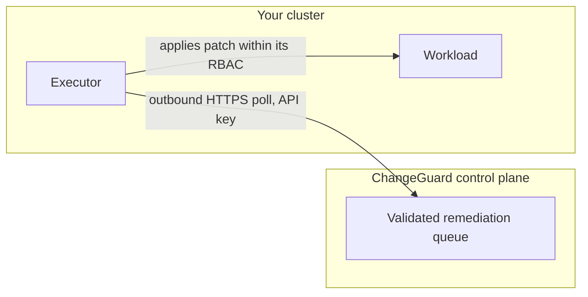

The most important security property of autonomous remediation is architectural, not procedural: **ChangeGuard's control plane has no credentials for your cluster.** All execution authority lives inside your cluster, in an executor you install, bounded by Kubernetes RBAC that you grant.

## How execution reaches your cluster

- The **executor** runs in your cluster and polls the control plane outbound over HTTPS, authenticating with a scoped API key. There is no inbound path: ChangeGuard cannot connect into your cluster, and there is no kubeconfig, token, or cloud credential for your cluster stored on our side.
- The control plane's only lever is what it **serves to the executor from the validated queue** - work that has already passed the [field allowlist and execution-policy checks](/autonomy/safety-guarantees).
- The executor applies patches using **its own ServiceAccount**, so every write is subject to Kubernetes RBAC evaluation in your cluster, attributable in your audit logs, and revocable by you at any moment.

## Two independent fences

Autonomous execution is bounded by two mechanisms that fail independently:

1. **The execution policy** (logical): namespaces, fix types, confidence floor, hourly cap - evaluated by the control plane at queue and serve time.
2. **The executor's RBAC** (physical): a namespace-scoped Role limited to patching workload resources (Deployments and similar) in the namespaces you chose at install time.

A control-plane bug, a compromised policy, or a malicious patch cannot cross the second fence: if the executor's ServiceAccount has no rights in a namespace, the Kubernetes API server refuses the write, full stop. For the same reason, keeping the executor's RBAC no broader than your policy's namespace allowlist is the recommended posture - the two should mirror each other.

## You hold the off switches

Every one of these is under your control, effective immediately, with no ChangeGuard involvement:

- **Scale the executor to zero** (or uninstall it) - queued work simply holds in `approved` and executes nothing; the platform was validated to hold and resume cleanly across executor outages.
- **Revoke the executor's API key** - the poll loop stops being served.
- **Shrink the executor's RBAC** - writes outside the new scope fail at the API server.
- **Empty the execution policy or lower the autonomy dial** - nothing further auto-queues, and already-queued work is demoted at serve time.

<Note>
  The executor is intentionally boring: it fetches validated work, records pre-state, applies a patch, reports the result, and heartbeats. Analysis, policy, verification, and audit all live in the control plane where they cannot widen cluster access. Executor liveness is monitored - a stale executor is flagged in the dashboard so "nothing is happening" is always distinguishable from "nothing is wrong."
</Note>