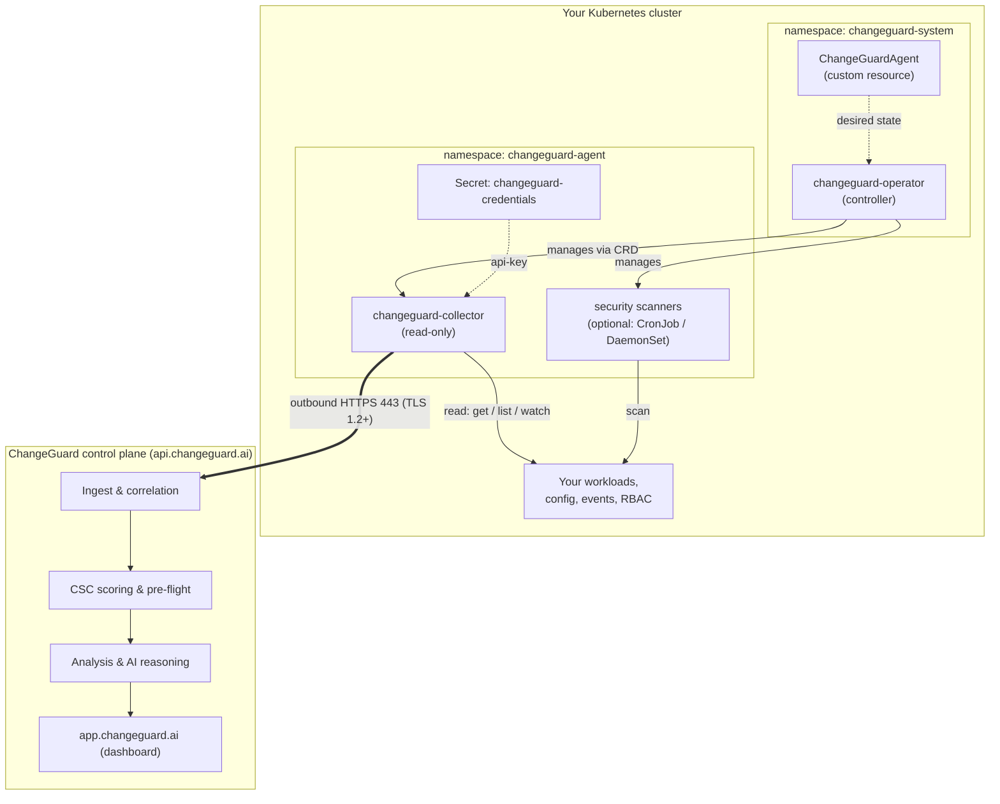
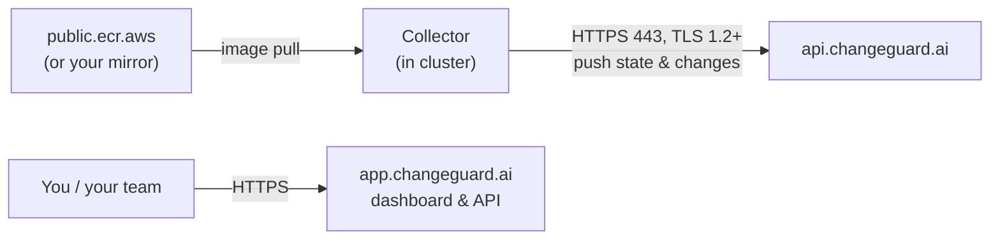
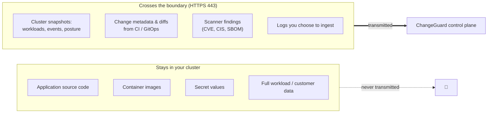
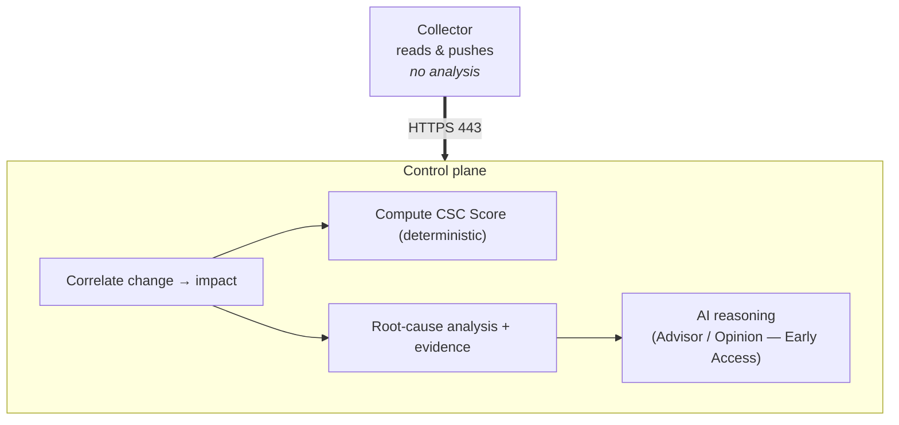

ChangeGuard AI has two halves: a small, read-only footprint **in your cluster**, and the **control plane** that does correlation, scoring, and analysis. This page shows exactly how they fit together and where your data lives.

## Deployment topology

The operator runs in `changeguard-system` and manages the collector (and optional scanners) in `changeguard-agent` through a CRD. Only the collector talks to the outside world.

<Info>
  There is **no inbound path** into your cluster. The control plane never connects _to_ you — the collector always initiates the connection _out_.
</Info>

## Communication paths

Exactly three network relationships exist, and all cluster-originated traffic is outbound HTTPS on 443.

<Warning>
  There is **no HTTP-proxy support** today. The collector's push client does not honor `HTTP_PROXY` / `HTTPS_PROXY`. The cluster needs direct outbound HTTPS to `api.changeguard.ai:443`. For air-gapped image pulls you can point `global.imageRegistry` at your own mirror, but the egress requirement stands.
</Warning>

## What leaves your cluster — and what never does

This is the boundary that matters most for review. The collector sends the metadata needed to correlate and score change; it does not send your code, images, or secret values.

| Sent to the control plane | Never leaves your cluster |
| --- | --- |
| Cluster snapshots (workloads, events, posture) | Application source code / container images |
| Change metadata and diffs from CI / GitOps | Kubernetes Secret **values** |
| Scanner findings (CVE, CIS, SBOM) | Full workload / customer data |
| Logs you explicitly ingest | — |

<Note>
  **Optional code graph.** If you enable the code-graph feature, ChangeGuard reads your repositories **in-cluster** and ships **only the derived knowledge graph** — never your raw source. Your source code still does not leave the cluster.
</Note>

<Info>
  Data the control plane stores is **tenant-isolated** at the database level using PostgreSQL row-level security, so one tenant's data is never visible to another.
</Info>

## Where the AI runs

All correlation, scoring, and AI reasoning run **in the control plane** — not in your cluster. AI analysis is powered by **Amazon Bedrock** (Claude models). The in-cluster collector does no analysis; it reads state and pushes it out. This keeps the cluster footprint tiny (one small collector pod with no persistent storage) and means model/analysis changes ship on the control-plane side without touching your cluster.

<Note>
  The deterministic **CSC Score** and the **AI reasoning** capabilities are distinct. Scoring is deterministic and generally available; the reasoning layers (Engineering Advisor, Engineering Opinion, and related) are **Early Access** and off by default. See [Product concepts](/concepts/overview).
</Note>

## Where data lives

| Data | Location | Notes |
| --- | --- | --- |
| Secret values, source, images | Your cluster only | Never transmitted. |
| Cluster snapshots, change history, findings | ChangeGuard control plane | Powers dashboards, scoring, and audit trails. |
| Your API key | A single in-cluster Secret (`changeguard-credentials`) \+ the control plane | Treat like a password; see [Operations](/operations/overview) for rotation. |
| Audit / activity timeline | Control plane | Append-only record per incident. |

## Cluster footprint at a glance

<CardGroup cols={3}>
  <Card title="Tiny" icon="feather">
    One lightweight pod (~13MB image; observed ~9m CPU / 21Mi memory on a small cluster). Current defaults (chart ≥ 5.3.6): requests 25m/64Mi, limits 500m/512Mi — overridable via `agent.collector.resources`. No PersistentVolumeClaims.
  </Card>

  <Card title="Non-root" icon="lock">
    The collector runs non-root. Optional security scanners differ — the Falco DaemonSet runs **privileged**; see [Permissions](/get-started/permissions#security-scanners-optional-on-by-default).
  </Card>

  <Card title="Read-only" icon="eye">
    `get` / `list` / `watch` only — no writes to your workloads unless you opt into remediation.
  </Card>
</CardGroup>

For the exact RBAC grants behind this, see [Permissions & RBAC](/get-started/permissions).