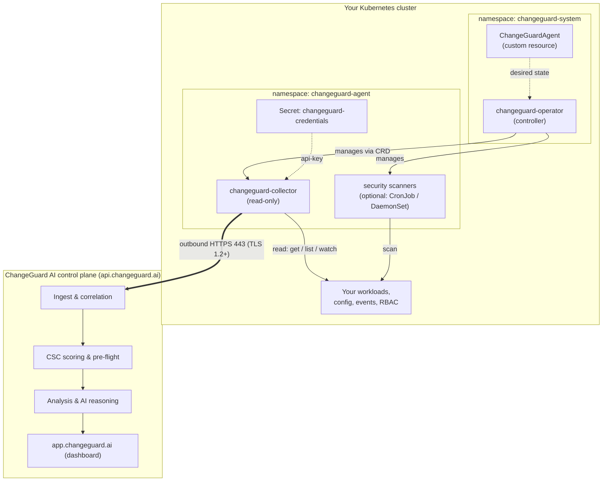
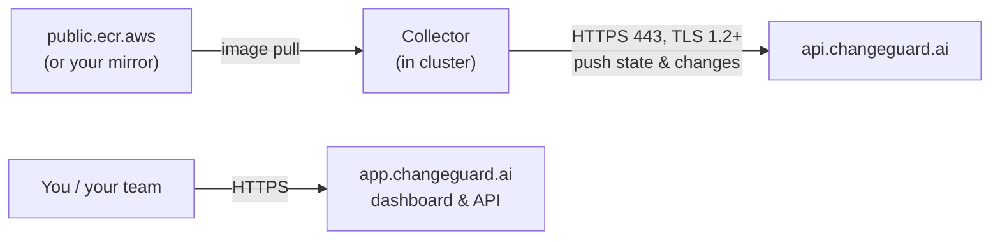
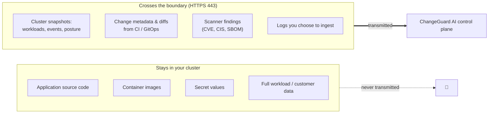
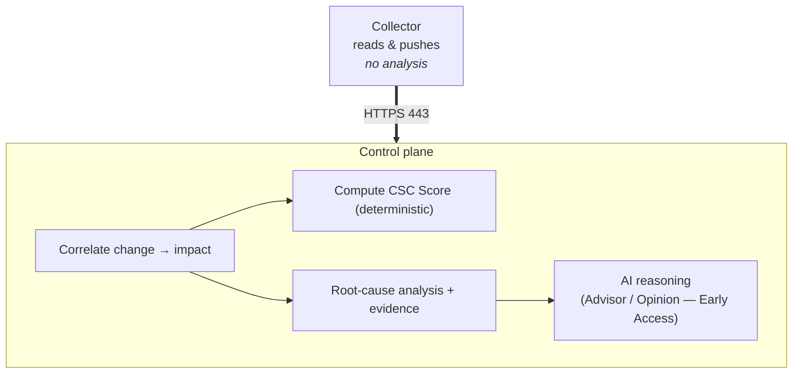
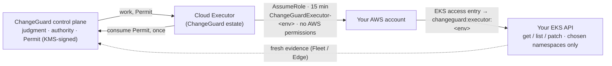

ChangeGuard AI acquires environment evidence two ways, and both feed the **same** control plane and the same decision plane:

- **ChangeGuard Fleet (default).** The Fleet service connects centrally to your Kubernetes API over customer-authorized, read-only access — for EKS, with short-lived AWS and Kubernetes credentials minted per collection cycle. Nothing is installed in the cluster for standard Kubernetes API-state evidence. See [Connect your EKS fleet](/get-started/connect-your-fleet).
- **ChangeGuard Edge (optional).** A small, read-only in-cluster footprint for evidence that requires local presence — runtime signals (Falco), node benchmarks (kube-bench) — or for environments Fleet cannot reach centrally.

The rest of this page describes the **Edge** in-cluster half and the control plane, and where your data lives. Fleet collects the same Kubernetes API state with a smaller grant (`get`/`list` only, no `watch`, no Secret access) and the same boundary guarantees — your source code, Secret values, and workload data stay in your cluster either way.

## Edge deployment topology

The operator runs in `changeguard-system` and manages the collector (and optional scanners) in `changeguard-agent` through a CRD. Only the collector talks to the outside world.

```mermaid
flowchart TB
  subgraph cluster["Your Kubernetes cluster"]
    subgraph sys["namespace: changeguard-system"]
      op["changeguard-operator<br/>(controller)"]
      crd["ChangeGuardAgent<br/>(custom resource)"]
    end
    subgraph agentns["namespace: changeguard-agent"]
      col["changeguard-collector<br/>(read-only)"]
      scan["security scanners<br/>(optional: CronJob / DaemonSet)"]
      sec["Secret: changeguard-credentials"]
    end
    workloads["Your workloads,<br/>config, events, RBAC"]
  end

  op -->|"manages via CRD"| col
  op -->|"manages"| scan
  crd -.->|"desired state"| op
  col -->|"read: get / list / watch"| workloads
  scan -->|"scan"| workloads
  sec -.->|"api-key"| col

  col ==>|"outbound HTTPS 443 (TLS 1.2+)"| cp

  subgraph external["ChangeGuard AI control plane (api.changeguard.ai)"]
    cp["Ingest &amp; correlation"]
    score["CSC scoring &amp; pre-flight"]
    ai["Analysis &amp; AI reasoning"]
    ui["app.changeguard.ai (dashboard)"]
    cp --> score --> ai --> ui
  end
```

<Info>
  **Evidence never needs an inbound path.** The Edge collector always initiates the connection _out_; Fleet reads the Kubernetes API over access you authorized. The one deliberate exception is **execution**: when you enable the Cloud Executor, ChangeGuard acts on your cluster through a separate, per-environment identity — and only with a consumed Permit. See [The execution path](#the-execution-path) below.
</Info>

## Communication paths

For evidence, exactly three network relationships exist, and all cluster-originated traffic is outbound HTTPS on 443. Execution, when you enable it, adds a fourth: the Executor's authenticated calls to your Kubernetes API, described in [The execution path](#the-execution-path).

```mermaid
flowchart LR
  col["Collector<br/>(in cluster)"] -->|"HTTPS 443, TLS 1.2+<br/>push state &amp; changes"| api["api.changeguard.ai"]
  reg["public.ecr.aws<br/>(or your mirror)"] -->|"image pull"| col
  you["You / your team"] -->|"HTTPS"| app["app.changeguard.ai<br/>dashboard &amp; API"]
```

<Warning>
  There is **no HTTP-proxy support** today. The collector's push client does not honor `HTTP_PROXY` / `HTTPS_PROXY`. The cluster needs direct outbound HTTPS to `api.changeguard.ai:443`. For air-gapped image pulls you can point `global.imageRegistry` at your own mirror, but the egress requirement stands.
</Warning>

## What leaves your cluster — and what never does

This is the boundary that matters most for review. The collector sends the metadata needed to correlate and score change; it does not send your code, images, or secret values.

```mermaid
flowchart LR
  subgraph inside["Stays in your cluster"]
    a1["Application source code"]
    a2["Container images"]
    a3["Secret values"]
    a4["Full workload / customer data"]
  end
  subgraph boundary["Crosses the boundary (HTTPS 443)"]
    b1["Cluster snapshots:<br/>workloads, events, posture"]
    b2["Change metadata &amp; diffs<br/>from CI / GitOps"]
    b3["Scanner findings<br/>(CVE, CIS, SBOM)"]
    b4["Logs you choose to ingest"]
  end
  inside -.->|"never transmitted"| x["🛑"]
  boundary ==>|"transmitted"| cp["ChangeGuard AI control plane"]
```

| Sent to the control plane | Never leaves your cluster |
| --- | --- |
| Cluster snapshots (workloads, events, posture) | Application source code / container images |
| Change metadata and diffs from CI / GitOps | Kubernetes Secret **values** |
| Scanner findings (CVE, CIS, SBOM) | Full workload / customer data |
| Logs you explicitly ingest | — |

<Note>
  **Optional code graph.** If you enable the code-graph feature, ChangeGuard AI reads your repositories **in-cluster** and ships **only the derived knowledge graph** — never your raw source. Your source code still does not leave the cluster.
</Note>

<Info>
  Data the control plane stores is **tenant-isolated** at the database level using PostgreSQL row-level security, so one tenant's data is never visible to another.
</Info>

## Where the AI runs

All correlation, scoring, and AI reasoning run **in the control plane** — not in your cluster. AI analysis is powered by **Amazon Bedrock** (Claude models). The in-cluster collector does no analysis; it reads state and pushes it out. This keeps the cluster footprint tiny (one small collector pod with no persistent storage) and means model/analysis changes ship on the control-plane side without touching your cluster.

```mermaid
flowchart TB
  col["Collector<br/>reads &amp; pushes<br/><i>no analysis</i>"] ==>|"HTTPS 443"| cp
  subgraph cp["Control plane"]
    correlate["Correlate change → impact"]
    csc["Compute CSC Score (deterministic)"]
    rca["Root-cause analysis + evidence"]
    advisor["AI reasoning<br/>(Advisor / Opinion — Early Access)"]
    correlate --> csc
    correlate --> rca
    rca --> advisor
  end
```

<Note>
  The deterministic **CSC Score** and the **AI reasoning** capabilities are distinct. Scoring is deterministic and generally available; the reasoning layers (Engineering Advisor, Engineering Opinion, and related) are **Early Access** and off by default. See [Product concepts](/concepts/overview).
</Note>

## The execution path

Evidence is read-only by construction. **Execution** — applying an approved fix — is a separate path with a separate identity, enabled per environment and inert until a [Permit](/govern/permit) exists.

```mermaid
flowchart LR
  cp["ChangeGuard control plane<br/>judgment · authority · Permit (KMS-signed)"] -->|"work, Permit"| ce["Cloud Executor<br/>(ChangeGuard estate)"]
  ce -->|"consume Permit, once"| cp
  ce -->|"AssumeRole · 15 min<br/>ChangeGuardExecutor-&lt;env&gt; · no AWS permissions"| role["Your AWS account"]
  role -->|"EKS access entry → changeguard:executor:&lt;env&gt;"| k8s["Your EKS API<br/>get / list / patch · chosen namespaces only"]
  k8s -.->|"fresh evidence (Fleet / Edge)"| cp
```

- The **Cloud Executor** runs in ChangeGuard's estate. For each environment you enable, it assumes a role in _your_ AWS account — `ChangeGuardExecutor-<environment-instance>`, with **no AWS permissions** and a trust policy admitting only ChangeGuard's Cloud Executor with your external ID — and authenticates to exactly that cluster through an EKS access entry you created, as a Kubernetes group that holds `get`, `list` and `patch` on workloads in the namespaces you chose. Nothing is installed.
- The **Local Executor** is the same component running inside your cluster, for topologies or policies that require local presence, under a per-environment ServiceAccount with the same narrow grant.
- Either Executor acts only on a Permit — signed in AWS KMS, bound to one action, one target, one environment, one approval or policy and a window of minutes, used once — and ChangeGuard verifies the outcome from fresh evidence afterwards. **VERIFIED** is never assumed.

Nothing about Fleet or Edge grants write access, and the Executor's identity cannot read Secrets, exec into pods, delete or create resources, or change RBAC. See [Cloud Executor](/execute/cloud-executor), [Local Executor](/execute/local-executor) and [Execution authority and least privilege](/autonomy/rbac-boundaries).

## Where data lives

| Data | Location | Notes |
| --- | --- | --- |
| Secret values, source, images | Your cluster only | Never transmitted. |
| Cluster snapshots, change history, findings | ChangeGuard AI control plane | Powers dashboards, scoring, and audit trails. |
| Your API key | A single in-cluster Secret (`changeguard-credentials`) \+ the control plane | Treat like a password; see [Operations](/operations/overview) for rotation. |
| Audit / activity timeline | Control plane | Append-only record per incident. |

## Cluster footprint at a glance

<CardGroup cols={3}>
  <Card title="Tiny" icon="feather">
    One lightweight pod (~13MB image; observed ~9m CPU / 21Mi memory on a small cluster). Current defaults (chart ≥ 5.3.6): requests 25m/64Mi, limits 500m/512Mi — overridable via `agent.collector.resources`. No PersistentVolumeClaims.
  </Card>

  <Card title="Non-root" icon="lock">
    The collector runs non-root. Optional security scanners differ — the Falco DaemonSet runs **privileged**; see [Permissions](/get-started/permissions#security-scanners-optional-on-by-default).
  </Card>

  <Card title="Read-only" icon="eye">
    `get` / `list` / `watch` only. Writes happen only through a separately enabled Executor identity, only with a Permit — see [The execution path](#the-execution-path).
  </Card>
</CardGroup>

For the exact RBAC grants behind this, see [Permissions & RBAC](/get-started/permissions).
